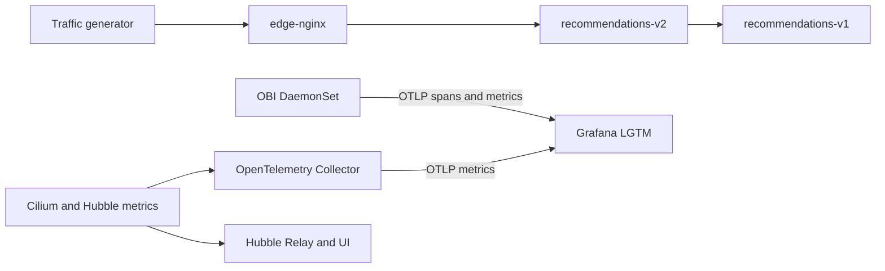
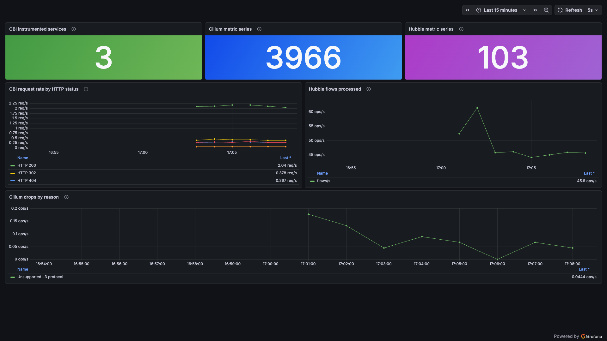
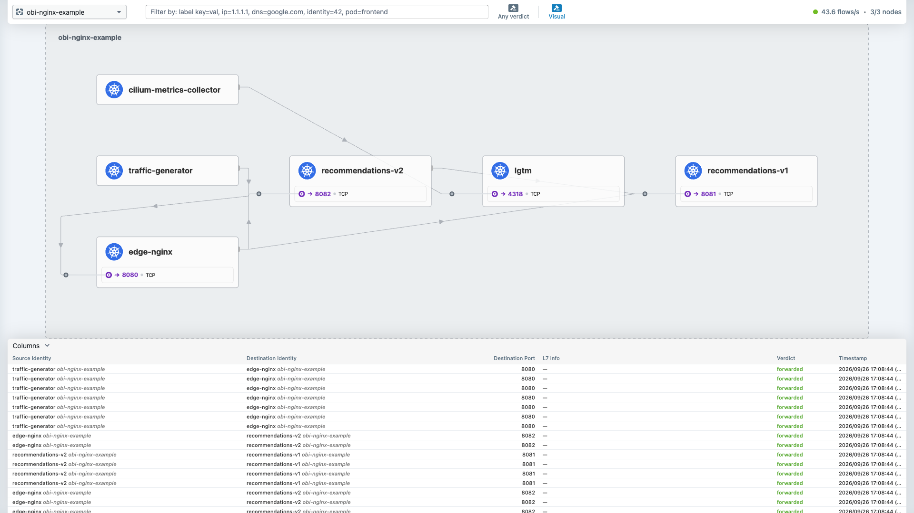

# Cilium and OpenTelemetry OBI coexistence demo

This repository runs Cilium, Hubble, and OpenTelemetry eBPF Instrumentation (OBI) together on a two-worker kind cluster. It supports the conference session **Two eBPF Systems, One Kubernetes Node**.

The demo answers three operator questions:

1. Did Cilium and OBI attach in a compatible order?
2. What does the same request look like in Hubble and in OBI telemetry?
3. What happens when Cilium policy denies the request?

## Architecture



OBI supplies application spans and RED metrics. Hubble supplies network identity, flow, verdict, and drop evidence. An OpenTelemetry Collector scrapes the Cilium agent and Hubble Prometheus endpoints and sends those metrics to the same Grafana LGTM instance. Hubble flow records remain available through Relay, the CLI, and Hubble UI.

## Live evidence

The same request path is visible as application telemetry in Grafana and as network flows in Hubble.





## Pinned versions

- Cilium chart and application: `1.20.2`
- OBI chart: `0.14.0`
- OBI application: `v0.13.0`
- OpenTelemetry Collector Contrib: `0.161.0`
- Upstream OBI example commit: `1d0b44040a861ac092261096491a7b3a1f269531`

Rehearse these exact pins before presenting. OBI is pre-1.0, so later releases can contain breaking changes.

## Prerequisites

- Docker Desktop with a healthy Linux engine
- kind
- kubectl
- Helm 3.13 or later
- Git
- curl

The Docker Linux VM must expose BTF and support TCX. The setup script checks BTF and tracefs inside a kind worker before installing the stack.

## Start the demo

```bash
git clone https://github.com/ajimenez1503/cilium-obi-demo.git
cd cilium-obi-demo
./demo/setup.sh
```

The setup script stops if the named cluster already exists. It never deletes a cluster automatically.

Open the interfaces in separate terminals:

```bash
kubectl -n obi-nginx-example port-forward svc/edge-nginx 8080:8080
kubectl -n obi-nginx-example port-forward svc/lgtm 3000:3000
kubectl -n kube-system port-forward svc/hubble-ui 12000:80
```

- Application: <http://localhost:8080>
- Grafana: <http://localhost:3000>, credentials `admin` / `admin`
- Hubble UI: <http://localhost:12000>

Import the dashboard suite after the Grafana port-forward is ready:

```bash
./demo/import-dashboards.sh
```

The suite contains five dashboards:

- **Cilium + OBI Live Demo**: compact presentation overview.
- **OBI Application Telemetry**: request rate, errors, latency percentiles,
  body sizes, routes, client/server observations, and trace-derived service
  edges.
- **Hubble Network Telemetry**: flows by verdict, protocol, observation point,
  and node, plus drops, TCP flags, ICMP, and lost events.
- **Cilium Datapath and Agent Health**: forwarding, drops, BPF map pressure,
  endpoint and policy state, controller health, CPU, and memory.
- **eBPF Telemetry Pipeline Health**: cross-system volume, Collector delivery,
  queueing, refusal, resource cost, and loss indicators.

Open the dashboard search at <http://localhost:3000/dashboards> and filter by
the `cilium-obi-demo` tag. Every dashboard also includes a navigation dropdown
for the complete suite.

To regenerate the four detailed dashboard JSON files after editing the source:

```bash
node scripts/generate-dashboards.mjs
```

If ports `8080` or `3000` are already in use, choose alternatives such as
`18080:8080` and `13000:3000`, then use the corresponding localhost ports in
the URLs and traffic command.

The Kubernetes traffic generator runs continuously. To generate one controlled request sweep:

```bash
./obi-cilium-demo-upstream/examples/nginx/generate-traffic.sh \
  --one-shot \
  --base-url http://127.0.0.1:8080
```

## Demo sequence

### 1. Prove coexistence

```bash
./demo/verify.sh
```

Use live status and log output as the proof. Do not infer TCX from Helm values alone.

### 2. Compare one successful request

- Hubble UI or CLI: workload identities, direction, and `FORWARDED` verdict.
- Grafana Tempo: OBI-generated client and server spans, route, duration, and HTTP status.
- Grafana metrics: OBI application metrics plus `cilium_*` and `hubble_*` series forwarded by the Collector.

Example Explore queries:

```promql
sum(rate(hubble_flows_processed_total[1m])) by (type, subtype)
```

```promql
sum(rate(cilium_drop_count_total[1m])) by (reason)
```

Metric names depend on enabled Cilium metrics and generated traffic. Use Grafana metric autocomplete to confirm the available series.

### 3. Show a policy denial

```bash
kubectl apply -f demo/policy-deny.yaml
kubectl delete -f demo/policy-deny.yaml
```

Hubble explains the network denial. OBI shows the upstream application error or timeout and the missing destination server span.

### 4. Optional L7 visibility

```bash
kubectl apply -f demo/policy-l7-visibility.yaml
kubectl delete -f demo/policy-l7-visibility.yaml
```

This inserts Envoy into the selected path. Treat it as a separate experiment because it changes the datapath and adds its own resource cost.

## Legacy traffic-control experiment

Run the legacy TC variant only in a fresh cluster. OBI v0.13.0 names the legacy backend `tc`.

Safe ordering, with OBI at priority 1 and Cilium at priority 2:

```bash
CLUSTER_NAME=obi-cilium-legacy \
CILIUM_EXTRA_VALUES="$PWD/demo/cilium-values-legacy-safe.yaml" \
OBI_EXTRA_VALUES="$PWD/demo/obi-values-legacy.yaml" \
./demo/setup.sh
```

Inspect the live filter order from a node:

```bash
docker exec obi-cilium-legacy-worker sh -c \
  'for device in $(ls /sys/class/net | grep ^veth | head -3); do tc filter show dev "$device" ingress; done'
```

For the guardrail demonstration, use `demo/cilium-values-legacy-unsafe.yaml`. Cilium keeps priority 1, so OBI is expected to reject the conflicting configuration.

## Cleanup

```bash
kind delete cluster --name obi-cilium-talk
```

## Evidence boundary

The manifests and scripts can be checked statically on macOS, but attachment behavior must be verified inside the Linux kind nodes. A ready DaemonSet alone does not prove compatible TCX or legacy TC ordering.

## References

- [OBI and Cilium compatibility](https://opentelemetry.io/docs/zero-code/obi/cilium-compatibility/)
- [OBI Kubernetes installation](https://opentelemetry.io/docs/zero-code/obi/setup/kubernetes/)
- [Cilium installation on kind](https://docs.cilium.io/en/stable/installation/kind/)
- [Hubble metrics](https://docs.cilium.io/en/stable/observability/metrics/)
